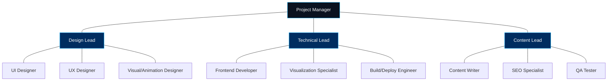
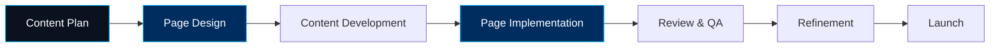
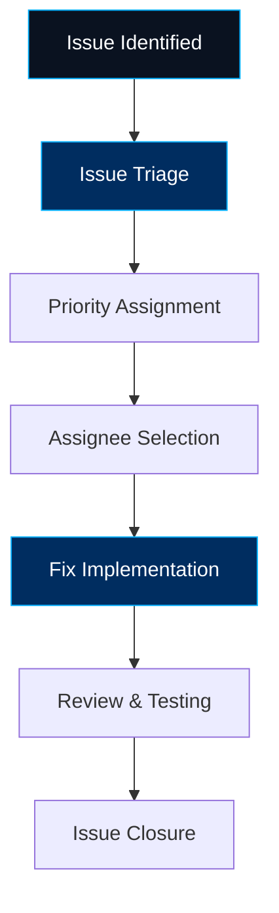

# Collaboration Framework

## Team Structure

## Roles & Responsibilities

### Project Management
- **Project Manager**
  - Overall project coordination
  - Timeline management
  - Stakeholder communication
  - Risk management

### Design Team
- **Design Lead**
  - Design system oversight
  - Design consistency enforcement
  - Style guide implementation
  - Design review coordination

- **UI Designer**
  - Component visual design
  - Layout design
  - Design system documentation

- **UX Designer**
  - User flow development
  - Information architecture
  - Interaction design
  - Usability testing

- **Visual/Animation Designer**
  - SVG animation design
  - Graph visualization styling
  - Motion design
  - Visual effects

### Development Team
- **Technical Lead**
  - Technical architecture
  - Code standards enforcement
  - Technical documentation
  - Performance oversight

- **Frontend Developer**
  - Leptos component implementation
  - Page development
  - Responsive design implementation
  - Accessibility compliance

- **Visualization Specialist**
  - Graph visualization implementation
  - Data binding
  - Interactive visualization features
  - WebAssembly optimizations

- **Build/Deploy Engineer**
  - Build system configuration
  - Deployment pipeline setup
  - Performance optimization
  - Monitoring implementation

### Content Team
- **Content Lead**
  - Content strategy
  - Editorial oversight
  - Content calendar management
  - Brand voice consistency

- **Content Writer**
  - Page content creation
  - Technical writing
  - Documentation writing
  - Copy editing

- **SEO Specialist**
  - Metadata optimization
  - SEO best practices
  - Analytics implementation
  - Performance tracking

- **QA Tester**
  - Functional testing
  - Cross-browser compatibility
  - Accessibility testing
  - Content review

## Workflow Process

### 1. Component Development Workflow

```mermaid
graph LR
    Spec[Component Specification] --> Design[Component Design]
    Design --> Review1[Design Review]
    Review1 --> Dev[Development]
    Dev --> Test[Component Testing]
    Test --> Review2[Code Review]
    Review2 --> Int[Integration]
    Int --> Deploy[Deployment]
    
    style Spec fill:#0A1220,color:#FDFEFF,stroke:#00B0FF
    style Design fill:#002D60,color:#FDFEFF,stroke:#00B0FF
    style Dev fill:#002D60,color:#FDFEFF,stroke:#00B0FF
    style Int fill:#002D60,color:#FDFEFF,stroke:#00B0FF
```

### 2. Page Development Workflow

### 3. Issue Resolution Process

## Collaboration Tools

### Version Control
- **GitHub**: Primary code repository
  - Branch structure:
    - `main`: Production branch, protected
    - `develop`: Development integration branch
    - `feature/*`: Feature development branches
    - `bugfix/*`: Bug fix branches
  - Pull request workflow with required reviews

### Task Management
- **GitHub Issues**: Task tracking and assignment
  - Labels:
    - `component`: Component-related tasks
    - `page`: Page-related tasks
    - `bug`: Issue fixes
    - `enhancement`: New features
    - `documentation`: Documentation tasks
    - Priority labels: `high`, `medium`, `low`
    - Status labels: `in-progress`, `ready-for-review`, `blocked`

### Documentation
- **GitHub Wiki**: Project documentation
  - Design documentation
  - Development standards
  - Component library documentation
  - Setup guides

### Communication
- **Regular Meetings**:
  - Weekly project status meeting
  - Daily standup (15 minutes)
  - Sprint planning (bi-weekly)
  - Sprint review/retrospective (bi-weekly)
- **Async Communication**:
  - GitHub Discussions for technical discussions
  - Pull request comments for code review

## Code Standards

### Rust/Leptos
- Follow Rust's official style guide
- Document public APIs with rustdoc
- Use Leptos best practices for reactivity
- Maintain type safety throughout codebase

### CSS/TailwindCSS
- Follow TailwindCSS class naming conventions
- Organize classes in consistent order
- Extract common patterns to components
- Use custom theme variables for colors and spacing

### Documentation
- Document all components with usage examples
- Maintain README files for each directory
- Document complex algorithms and business logic
- Keep API documentation up to date

## Quality Assurance

### Automated Testing
- Unit tests for component logic
- Integration tests for page functionality
- Accessibility automated testing
- Performance benchmarking

### Manual Testing
- Cross-browser compatibility testing
- Mobile/responsive design testing
- Content review
- User flow validation

### Peer Review
- Code review for all pull requests
- Design review for all component designs
- Content review for all page content
- Accessibility review

## Continuous Integration/Deployment

### CI Pipeline
- Automated on push to branches:
  - Code linting
  - Compilation check
  - Unit tests
  - Build verification

### CD Pipeline
- Automated on merge to `develop`:
  - Deployment to staging environment
- Automated on merge to `main`:
  - Deployment to production
  - Tag creation
  - Release notes generation

## Decision Making Process

### Design Decisions
1. Proposal with rationale
2. Review by design team
3. Feedback and iteration
4. Final approval by design lead
5. Documentation of decision

### Technical Decisions
1. RFC (Request for Comments) with options
2. Discussion with development team
3. Prototype if needed
4. Decision by technical lead
5. Documentation in wiki

## Escalation Path

### Technical Issues
1. Developer team discussion
2. Technical lead review
3. Project manager escalation
4. Stakeholder input if needed

### Design Issues
1. Design team discussion
2. Design lead review
3. User testing if applicable
4. Project manager escalation

### Schedule Issues
1. Team lead assessment
2. Project manager review
3. Timeline adjustment proposal
4. Stakeholder approval 