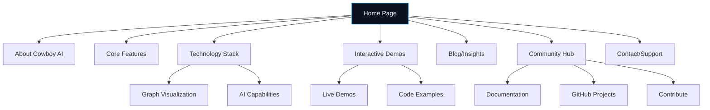

# Cowboy AI Website Sitemap

## Primary Navigation

## Page Structure Details

### Home (/)
- Hero section with animated logo
- Value proposition statement
- Featured capabilities visualization
- Quick links to demos
- Visual journey into core technologies

### About (/about)
- Company vision and mission
- Team profiles with visual connections
- Development timeline
- Values and principles
- Future roadmap

### Core Features (/features)
- AI Orchestration capabilities
- Integration options
- Scalability features
- Performance characteristics
- Use case examples

### Technology Stack (/technology)
- Technology overview with interactive graph
- Rust ecosystem integration
- Graph visualization capabilities
  - Petgraph implementation (/technology/graph/petgraph)
  - Mermaid integration (/technology/graph/mermaid)
  - Cypher support (/technology/graph/cypher)
- AI capabilities detailed explanation

### Interactive Demos (/showcase)
- Live demonstration dashboard
- Interactive examples
- Code snippets with syntax highlighting
- Customizable parameters
- Results visualization

### Blog/Insights (/blog)
- Latest articles
- Technical deep dives
- Case studies
- Research findings
- Tutorial content

### Community Hub (/community)
- Documentation center
- GitHub repositories
- Contribution guidelines
- Community projects showcase
- Discussion forums/links

### Contact/Support (/contact)
- Contact form
- Support resources
- FAQ section
- Social media links
- Newsletter signup

## Secondary Navigation

- Legal information (/legal)
  - Privacy policy
  - Terms of service
- Site map (/sitemap)
- Accessibility statement (/accessibility)
- Search functionality (global) 