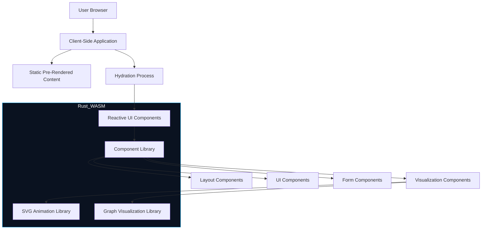

# Technical Implementation Strategy

## Technology Stack 

### Core Technologies
- **Rust**: Primary programming language
- **Leptos**: Rust-based reactive web framework
- **TailwindCSS**: Utility-first CSS framework
- **WebAssembly**: For high-performance browser execution

### Visualization Technologies
- **SVG**: Vector graphics for animations and visualizations
- **Leptos SVG Integration**: Custom SVG manipulation via Leptos
- **Graph Renderer**: Custom implementation supporting multiple formats

### Development Tools
- **Cargo**: Rust package manager
- **Trunk**: WASM bundler and development server
- **cargo-leptos**: Integrated build tool
- **Git**: Version control system
- **GitHub Actions**: CI/CD pipeline

## Architecture Overview



## Development Approach

### Project Structure

```
thecowboyai-website/
├── Cargo.toml
├── index.html
├── style.css
├── src/
│   ├── main.rs              # Application entry point
│   ├── app.rs               # Main application component
│   ├── components/          # Reusable UI components
│   │   ├── layout/          # Layout components
│   │   ├── ui/              # UI elements
│   │   ├── visualization/   # Graph and data visualization
│   │   ├── form/            # Form elements
│   │   └── media/           # Media components
│   ├── pages/               # Page components
│   │   ├── home.rs
│   │   ├── about.rs
│   │   └── ...
│   ├── utils/               # Utility functions
│   └── lib.rs               # Common code/exports
├── public/                  # Static assets
│   ├── images/
│   ├── fonts/
│   └── data/                # Sample data for visualizations
└── tailwind.config.js       # TailwindCSS configuration
```

### Build Process

1. **Development Build**
   - Local development server with hot reload
   - TailwindCSS JIT compilation
   - Debug WASM compilation

2. **Production Build**
   - Optimized WASM compilation with `wasm-opt`
   - TailwindCSS purge for minimal CSS
   - Static pre-rendering of critical pages
   - Asset optimization (images, fonts)

3. **Deployment Pipeline**
   - GitHub Actions workflow
   - Build validation and testing
   - Deployment to GitHub Pages

## Implementation Approach

### Phase 1: Foundation
- Set up project structure and build system
- Implement core layout components
- Create basic navigation and routing
- Establish theming system
- Implement responsive design foundation

### Phase 2: Core Components
- Develop UI component library following style guide
- Implement basic form components
- Create static versions of primary pages
- Set up theme switching functionality
- Implement responsive behavior for all components

### Phase 3: Visualization Engine
- Develop SVG animation library
- Create graph visualization engine
- Implement data binding for visualizations
- Build interactive demos
- Optimize performance for complex visualizations

### Phase 4: Integration and Content
- Integrate all components into pages
- Populate with final content
- Implement SEO optimization
- Add analytics tracking
- Ensure accessibility compliance

### Phase 5: Optimization and Launch
- Performance optimization
- Cross-browser testing
- Responsive design validation
- Final accessibility review
- Deploy to production

## Graph Visualization Strategy

### Format Support Implementation

1. **Abstract Interface**
   - Create a common trait for graph data
   - Implement adapters for different formats:
     - Petgraph adapter
     - Mermaid parser/adapter
     - Cypher query adapter

2. **Rendering Pipeline**
   - Parse input format
   - Convert to internal representation
   - Layout calculation (force-directed, hierarchical, etc.)
   - SVG generation
   - Interactive elements attachment

3. **Optimizations**
   - Lazy loading of large graphs
   - Incremental rendering for complex visualizations
   - WebAssembly for layout calculations
   - View culling for large graphs

## SVG Animation Framework

### Animation Types

1. **Static Animations**
   - Predefined animation sequences
   - CSS-based transitions and keyframes
   - SVG SMIL animations for complex paths

2. **Data-Driven Animations**
   - Animations based on data changes
   - Transition between states
   - Highlighting and focus effects

3. **Interactive Animations**
   - User-triggered animations
   - Hover and click effects
   - Draggable elements

### Implementation Strategy

1. **Animation Library**
   - Create reusable animation components
   - Define standard animation patterns
   - Implement timing functions and easing

2. **Integration with Components**
   - Add animation capabilities to UI components
   - Create animated transitions between pages
   - Implement scroll-triggered animations

## Performance Optimization Strategy

1. **Initial Load Optimization**
   - Code splitting for route-based components
   - Preload critical resources
   - Optimize WASM bundle size

2. **Runtime Performance**
   - Use WebAssembly for computation-heavy operations
   - Efficient reactivity with Leptos signals
   - SVG optimizations for complex visualizations

3. **Perceived Performance**
   - Strategic loading animations
   - Content progressive loading
   - Background data fetching

## Collaboration Workflow

1. **Component Development**
   - Isolated component development
   - Component documentation
   - Visual testing with different states

2. **Integration Testing**
   - Component integration testing
   - Page layout validation
   - Responsive design verification

3. **Code Review Process**
   - Style guide compliance check
   - Performance review
   - Accessibility review

## Testing Strategy

1. **Unit Testing**
   - Component logic tests
   - Utility function tests
   - Format parsing tests

2. **Integration Testing**
   - Component interaction tests
   - Page rendering tests
   - State management tests

3. **User Interface Testing**
   - Visual regression testing
   - Accessibility testing
   - Cross-browser compatibility testing

## Deployment Strategy

1. **Staging Deployment**
   - Automated deployment to staging environment
   - Integration testing in staging
   - Performance testing

2. **Production Deployment**
   - Automated deployment to GitHub Pages
   - CDN configuration
   - Monitoring setup

3. **Post-Deployment Verification**
   - Availability monitoring
   - Performance monitoring
   - Error tracking 